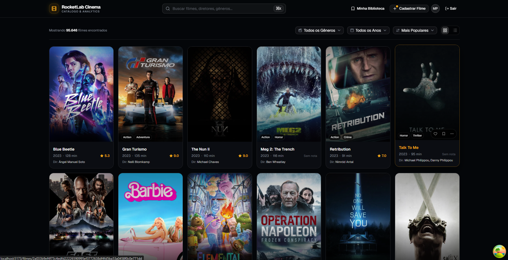
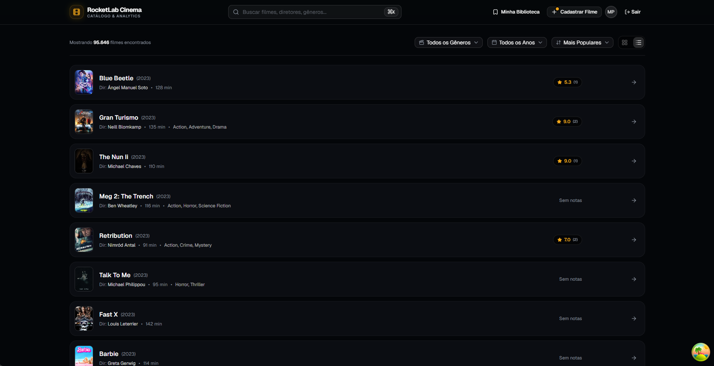
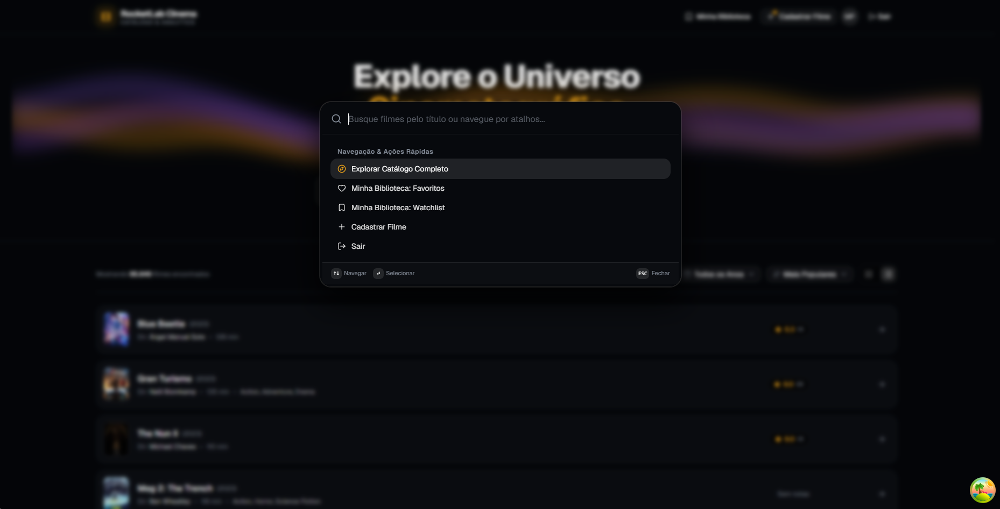
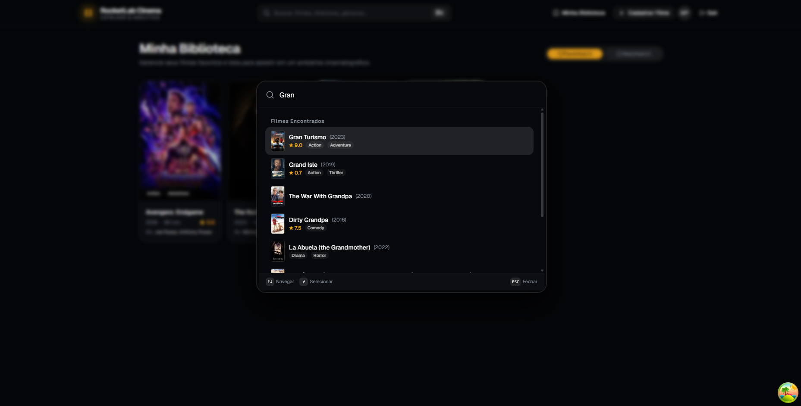
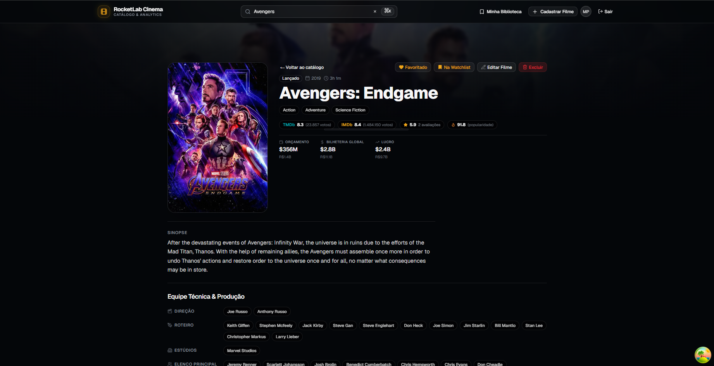
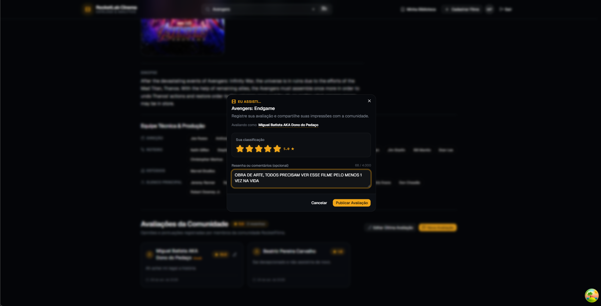
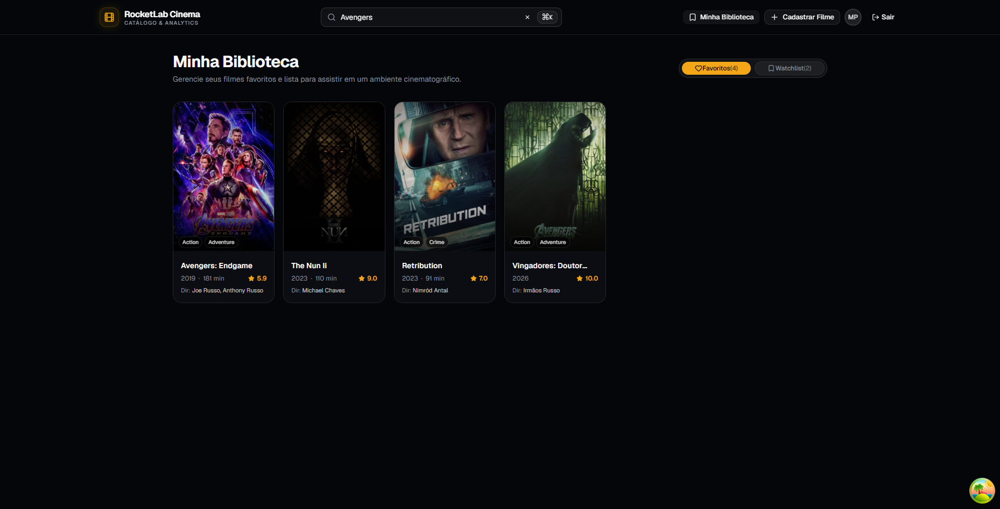
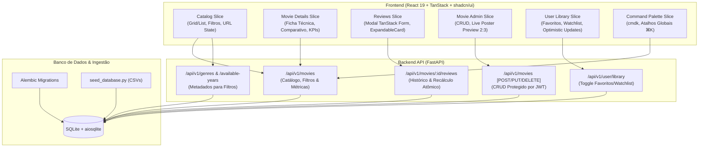

# CineFlow — Catálogo Cinematográfico & Hub Analítico

<div align="center">

[](https://fastapi.tiangolo.com)
[](https://www.python.org)
[](https://react.dev)
[](https://www.typescriptlang.org)
[](https://vitejs.dev)
[](https://tailwindcss.com)
[](https://ui.shadcn.com)
[](https://tanstack.com/query)
[](https://sqlite.org)
[](https://docs.astral.sh/uv/)
[](https://bun.sh)

Plataforma cinematográfica completa inspirada no Letterboxd, integrando catálogo analítico de alta performance, ficha técnica editorial, sistema de avaliações comunitárias, biblioteca pessoal e painel administrativo para gestão de obras.

</div>

---

## 🎬 Demonstração & Mídias da Aplicação

### 🎥 Navegação & Visão Geral (Vídeos)

| Visão Geral do Catálogo & Navegação | Ações Rápidas, Resenhas & Minha Lista |
| :---: | :---: |
| https://github.com/user-attachments/assets/media/catalog-page-overviewmp4.mp4 <br> *(Vídeo: `media/catalog-page-overviewmp4.mp4`)* | https://github.com/user-attachments/assets/media/catalog-page-context-menu-review-favorite-add-to-list.mp4 <br> *(Vídeo: `media/catalog-page-context-menu-review-favorite-add-to-list.mp4`)* |

| Autenticação & Entrada de Administrador |
| :---: |
| https://github.com/user-attachments/assets/media/login-page-overview-mp4.mp4 <br> *(Vídeo: `media/login-page-overview-mp4.mp4`)* |

> 💡 **Arquivos de vídeo locais:** Todos os vídeos em alta fidelidade estão disponíveis no diretório [`media/`](file:///home/miguelsb/workspace/visagio-atividade-dev-2026/media):
> - [`media/catalog-page-overviewmp4.mp4`](file:///home/miguelsb/workspace/visagio-atividade-dev-2026/media/catalog-page-overviewmp4.mp4) — Exploração fluida do catálogo, paginação e alternância de modos.
> - [`media/catalog-page-context-menu-review-favorite-add-to-list.mp4`](file:///home/miguelsb/workspace/visagio-atividade-dev-2026/media/catalog-page-context-menu-review-favorite-add-to-list.mp4) — Menu de contexto (`···` e clique direito), adição de resenha, favoritar e watchlist.
> - [`media/login-page-overview-mp4.mp4`](file:///home/miguelsb/workspace/visagio-atividade-dev-2026/media/login-page-overview-mp4.mp4) — Experiência de login, ilustrações Storyset interativas e transições.

---

### 📸 Telas e Fluxos Principais

#### Catálogo & Modos de Visualização
| Catálogo em Grid (Pôsteres 2:3) | Catálogo em Lista Analítica |
| :---: | :---: |
|  |  |

#### Command Palette (⌘K) & Busca Rápida
| Command Palette no Catálogo | Busca Rápida de Filmes |
| :---: | :---: |
|  |  |

#### Ficha Técnica Editorial & Avaliações
| Ficha Técnica & Backdrop Panorâmico | Avaliação & Nova Resenha |
| :---: | :---: |
|  |  |

#### Gestão de Obras & Biblioteca Pessoal
| Cadastro / Edição com Live Poster Preview | Minha Biblioteca (Favoritos & Watchlist) |
| :---: | :---: |
|  |  |

---

## 🎯 Histórias de Usuário & Funcionalidades

O sistema foi desenhado a partir dos requisitos centrais da especificação oficial e expandido com recursos de ponta:

- **Navegação no Catálogo Paginado:**
  - Alternância imediata entre visualização em **Grid (Cards 2:3)** e **Lista Analítica**.
  - Filtros dinâmicos por **Gênero** e **Ano de Lançamento** (alimentados diretamente do banco de dados).
  - Ordenação multicritério por Popularidade, Nota dos Usuários, Bilheteria (USD), Ano de Lançamento e Título.
- **Busca Global e Instantânea:**
  - Barra de pesquisa integrada in-page e **Command Palette (`⌘K` / `Ctrl+K`)** para busca em tempo real com debouncing e navegação via teclado.
- **Ficha Técnica & Comparativo Analítico:**
  - Dados completos da obra (sinopse, duração formatada, diretor, roteiristas, estúdios e elenco principal).
  - **Comparador de Notas:** Avaliação média interna do CineFlow vs. TMDb vs. IMDb.
  - **Painel Financeiro & Métricas:** Orçamento, faturamento global, ROI consolidado (USD/BRL) e índice de popularidade.
  - Lightbox para ampliação do pôster em alta definição.
- **Comunidade & Avaliações:**
  - Submissão de novas avaliações com notas de **1 a 10** e resenha em texto.
  - Recálculo atômico e transacional da nota média e total de avaliações do filme.
  - Histórico de resenhas com cards interativos e expansão suave de comentários longos.
- **Biblioteca Pessoal do Usuário (Minha Lista):**
  - Salvar em **Favoritos** e **Watchlist** em 1 clique (na pílula de hover do pôster, no menu de contexto ou na ficha técnica).
  - **Optimistic Updates:** Feedback visual instantâneo sem congelar a interface.
  - Aba unificada `/minha-lista` para gerenciar as obras salvas.
- **Administração de Catálogo (CRUD Completo):**
  - Autenticação segura com emissão de token JWT (`admin@rocketfilms.com` / `admin123`).
  - Cadastro de novos filmes com validação em tempo real e **Live Poster Preview 2:3**.
  - Edição de filmes existentes com recuperação de rascunhos.
  - Exclusão segura com diálogo de confirmação destrutivo e remoção em cascata.

---

## 🚀 Como Executar o Projeto

### 1. Pré-Requisitos e Arquivos de Dados (CSV)

O projeto depende de **Python 3.11+**, [**uv**](https://docs.astral.sh/uv/) e [**Bun**](https://bun.sh/).

> ⚠️ **IMPORTANTE (Arquivos CSV Necessários):**  
> A ingestão de dados analíticos requer que os arquivos CSV fornecidos estejam presentes no diretório raiz [`data/`](file:///home/miguelsb/workspace/visagio-atividade-dev-2026/data):
> - `dim_movies.csv`
> - `dim_genres.csv`
> - `dim_companies.csv`
> - `dim_people.csv`
> - `bridge_movie_genre.csv`
> - `bridge_movie_company.csv`
> - `bridge_movie_person.csv`
> - `fact_movies_performance.csv`
> - `dim_reviews.csv`
> - `movies_reviews.csv`

---

### 2. Configuração do Backend (FastAPI + SQLite + Alembic)

No terminal, a partir da raiz do repositório:

```bash
cd backend

# 1. Copiar variáveis de ambiente de exemplo
cp .env.example .env

# 2. Sincronizar o ambiente virtual e instalar dependências via uv
uv sync --all-extras

# 3. Aplicar as migrações do banco de dados relacional via Alembic
uv run alembic upgrade head

# 4. Executar o script de seed para popular o banco com os CSVs de data/
uv run python scripts/seed_database.py

# 5. Iniciar o servidor de desenvolvimento FastAPI
uv run uvicorn app.main:app --reload --port 8000
```

- **API REST:** `http://localhost:8000`
- **Documentação Interativa (Swagger/OpenAPI):** `http://localhost:8000/docs`
- **Health Check:** `http://localhost:8000/health`

---

### 3. Configuração do Frontend (Vite + React 19 + Bun)

Em outro terminal:

```bash
cd frontend

# 1. Instalar dependências com Bun
bun install

# 2. Iniciar o servidor de desenvolvimento Vite
bun run dev
```

- **Aplicação Web:** `http://localhost:5173`

#### Credenciais de Acesso (Administrador)
- **E-mail:** `admin@rocketfilms.com`
- **Senha:** `admin123`
*(A tela de login possui botão de preenchimento automático para testes rápidos).*

---

### 4. Testes Automatizados & Qualidade de Código

```bash
# Testes do Backend (Pytest assíncrono - 37 testes)
cd backend && uv run pytest

# Testes do Frontend (Vitest - 143 testes)
cd frontend && bun run test

# Linters e Checagem de Tipos
cd backend && uv run ruff check .
cd frontend && bun run lint && bun run build
```

---

## 🏛️ Arquitetura em Vertical Slices

Ao invés de camadas horizontais que espalham a mesma funcionalidade por diretórios técnicos distantes, o CineFlow adota **Vertical Slice Architecture**. Cada domínio de funcionalidade agrupa suas próprias rotas, contratos de dados, regras de negócio e componentes de interface.



### Princípios-Chave:
1. **Linguagem Onipresente (Ubiquitous Language):** Os mesmos termos canônicos (`titulo`, `sinopse`, `ano_lancamento`, `duracao_minutos`, `url_poster`, `url_backdrop`, `nota_media_usuarios`, `comentario`) são rigorosamente preservados do banco SQLite até o TanStack Form.
2. **Separação UI Pura vs. Orquestração:** Componentes visuais (`*View.tsx`) recebem apenas dados via props; a orquestração de queries, mutações e cache fica isolada em Containers e Hooks dedicados.
3. **Design Editorial Anti-Cardite:** Experiência cinematográfica limpa com foco visual nas obras, tipografia Geist, contenção cromática e zero ruído visual.

---

## 📖 Documentação Detalhada

Para guias aprofundados de arquitetura, design system, boas práticas e planejamento, consulte a pasta [`docs/`](docs/README.md):
- [**docs/architecture/**](docs/architecture/ARQUITETURA.md): Decisões arquiteturais, contratos de dados e diretrizes de backend.
- [**docs/design/**](docs/design/DESIGN.md): Tokens semânticos, paleta escura cinematográfica e design system shadcn.
- [**docs/engineering/**](docs/engineering/GUIDELINES.md): Boas práticas com React 19, hooks e requisitos não-funcionais.
- [**docs/planning/**](docs/planning/plano-execucao.md): Plano de execução detalhado com checklist e rastreabilidade de todas as fatias verticais.
- [**docs/specs/**](docs/specs/atividade-dev.md): Requisitos funcionais da especificação oficial.

