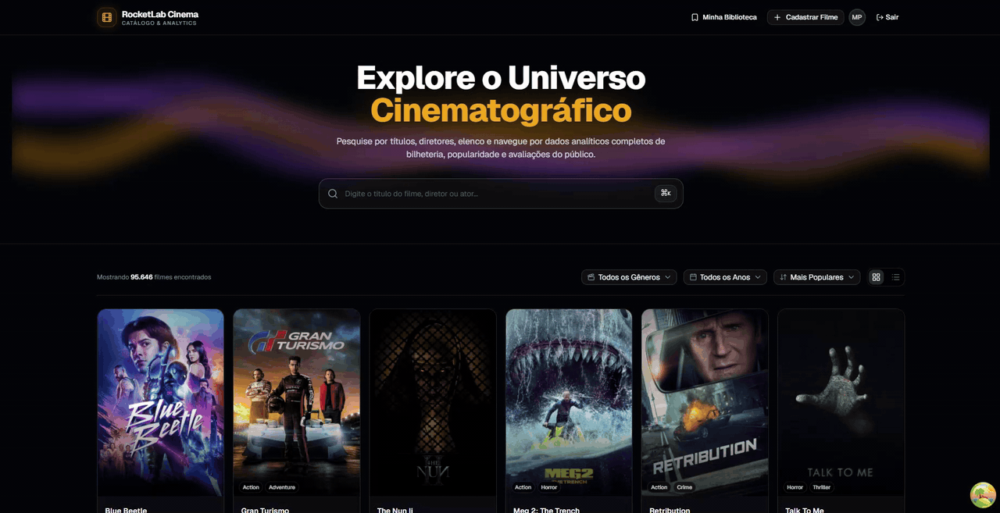
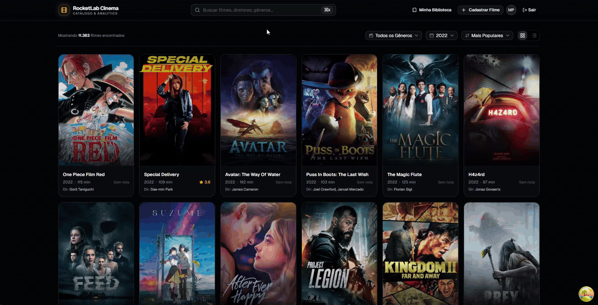
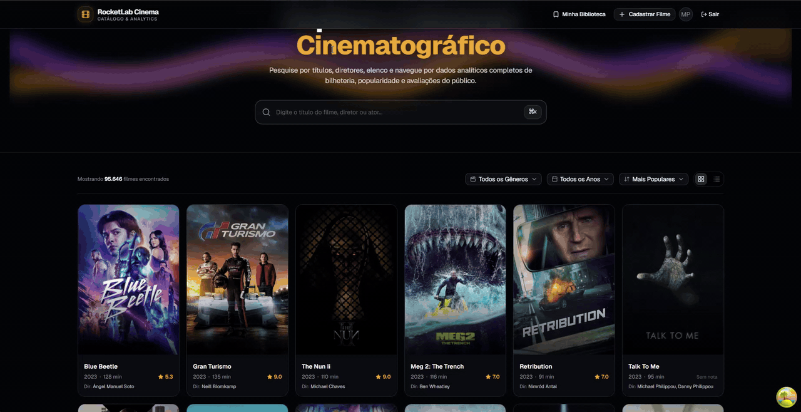
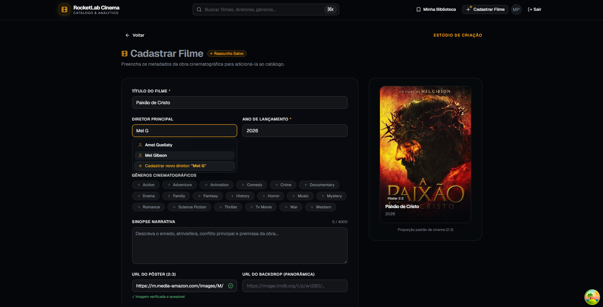
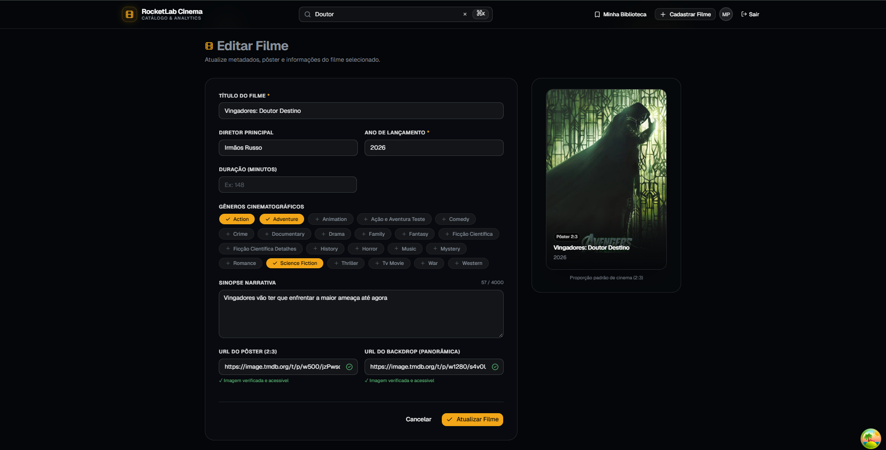

# CineFlow — Catálogo Cinematográfico & Hub Analítico

<div align="center">

[](https://fastapi.tiangolo.com)
[](https://www.python.org)
[](https://react.dev)
[](https://www.typescriptlang.org)
[](https://vitejs.dev)
[](https://tailwindcss.com)
[](https://ui.shadcn.com)
[](https://tanstack.com/query)
[](https://sqlite.org)
[](https://docs.astral.sh/uv/)
[](https://bun.sh)

Plataforma cinematográfica completa inspirada no Letterboxd, integrando catálogo analítico de alta performance, ficha técnica editorial, sistema de avaliações comunitárias, biblioteca pessoal e painel administrativo para gestão de obras.

</div>

---

## 📑 Sumário

- [🎬 Demonstração & Mídias da Aplicação](#-demonstração--mídias-da-aplicação)
  - [🎥 Demonstração em Vídeo & Animações](#-demonstração-em-vídeo--animações)
  - [📸 Telas e Fluxos Principais](#-telas-e-fluxos-principais)
- [🎯 Histórias de Usuário & Funcionalidades](#-histórias-de-usuário--funcionalidades)
- [🚀 Como Executar o Projeto](#-como-executar-o-projeto)
  - [1. Pré-Requisitos e Arquivos de Dados (CSV)](#1-pré-requisitos-e-arquivos-de-dados-csv)
  - [2. Inicialização Rápida em Um Comando](#2-inicialização-rápida-em-um-comando-recomendado)
  - [3. Configuração Manual Passo a Passo](#3-configuração-manual-passo-a-passo-opcional)
  - [4. Testes Automatizados & Qualidade de Código](#4-testes-automatizados--qualidade-de-código)
- [🏛️ Arquitetura em Vertical Slices](#️-arquitetura-em-vertical-slices)
- [📖 Documentação Detalhada](#-documentação-detalhada)

---

## 🎬 Demonstração & Mídias da Aplicação

### 🎥 Demonstração em Vídeo & Animações

#### 1. Visão Geral do Catálogo & Navegação Fluida
Demonstração da experiência de navegação do usuário pelo catálogo cinematográfico, alternando suavemente entre os modos de visualização em Grid e Lista Analítica, aplicando filtros combinados por gênero e navegando pelas páginas com carregamento ultrarrápido.



---

#### 2. Ações Rápidas: Menu de Contexto, Avaliação, Favoritos & Watchlist
Interações contextuais diretas sobre as obras: clique com o botão direito para acionar o menu de contexto, inclusão imediata nos Favoritos e na Watchlist via atualizações otimistas e abertura ágil do modal de avaliação com notas.



---

#### 3. Command Palette (⌘K / Ctrl+K) — Busca Global & Navegação Instantânea
Acesso instantâneo a qualquer filme, diretor ou seção do sistema através do atalho universal de teclado. Inclui busca com debouncing em tempo real, visualização de metadados no dropdown e navegação completa por setas sem tirar as mãos do teclado.



---

#### 4. Autenticação Administrativa & Microinterações de Login
Fluxo de autenticação do painel de administração com validação de credenciais, geração de token seguro JWT, microinterações visuais de formulário e atalho de preenchimento automático para agilizar testes e homologações.


---

### 📸 Telas e Fluxos Principais

#### 1. Catálogo em Grid Cinematográfico (Pôsteres 2:3)
Visualização imersiva do catálogo de filmes com pôsteres em alta resolução na proporção 2:3, pílula de ações rápidas ao passar o mouse (favoritar, watchlist, avaliar), paginação eficiente e filtros combinados por gênero e ano de lançamento.


---

#### 2. Catálogo em Lista Analítica
Modo de exibição alternativo, popularidade, comparativo de notas e mais metadados de cada produção em layout tabular responsivo.


---

#### 3. Ficha Técnica Editorial & Backdrop Panorâmico
Página detalhada da obra com imagem de fundo panorâmica em alta definição, sinopse, ficha de equipe (diretor, roteiristas, estúdios), painel financeiro comparativo (USD/BRL) e pontuação consolidada (CineFlow, TMDb e IMDb).


---

#### 4. Avaliações Comunitárias & Nova Resenha
Diálogo intuitivo para submissão de notas e resenhas em texto livre, com recálculo atômico e transacional da média da comunidade e exibição imediata na lista de críticas com expansão de texto.


---

#### 5. Estúdio de Criação de Filmes (Live Poster Preview & Auto-Save)
Formulário avançado de cadastro para administradores com validação assíncrona de URL da imagem em tempo real (`✓ Imagem verificada e acessível`), renderização instantânea do pôster 2:3 no card lateral e persistência automática de rascunhos (`• Rascunho Salvo`) para evitar perda de dados em caso de recarregamento acidental da página.



---

#### 6. Edição de Metadados & Gestão de Títulos
Painel para atualização de informações cadastrais, ajuste de diretores via combobox com busca inteligente e exclusão controlada com diálogo de confirmação destrutivo.



---

#### 7. Minha Biblioteca (Favoritos & Watchlist)
Área pessoal do cinéfilo para gerenciamento das obras salvas, com abas dedicadas para Filmes Favoritos e Lista de Desejos (Watchlist) sincronizadas instantaneamente via atualizações otimistas.


---

## 🎯 Histórias de Usuário & Funcionalidades

O sistema foi desenhado a partir dos requisitos centrais da especificação oficial e expandido com recursos de ponta:

- **Navegação no Catálogo Paginado:**
  - Alternância imediata entre visualização em **Grid (Cards 2:3)** e **Lista Analítica**.
  - Filtros dinâmicos por **Gênero** e **Ano de Lançamento** (alimentados diretamente do banco de dados).
  - Ordenação multicritério por Popularidade, Nota dos Usuários, Bilheteria (USD), Ano de Lançamento e Título.
- **Busca Global e Instantânea:**
  - Barra de pesquisa integrada in-page e **Command Palette (`⌘K` / `Ctrl+K`)** para busca em tempo real com debouncing e navegação via teclado.
- **Ficha Técnica & Comparativo Analítico:**
  - Dados completos da obra (sinopse, duração formatada, diretor, roteiristas, estúdios e elenco principal).
  - **Comparador de Notas:** Avaliação média interna do CineFlow vs. TMDb vs. IMDb.
  - **Painel Financeiro & Métricas:** Orçamento, faturamento global, ROI consolidado (USD/BRL) e índice de popularidade.
  - Lightbox para ampliação do pôster em alta definição.
- **Comunidade & Avaliações:**
  - Submissão de novas avaliações com notas de **0 a 10** e resenha em texto.
  - Recálculo atômico e transacional da nota média e total de avaliações do filme.
  - Histórico de resenhas com cards interativos e expansão suave de comentários longos.
- **Biblioteca Pessoal do Usuário (Minha Lista):**
  - Salvar em **Favoritos** e **Watchlist** em 1 clique (na pílula de hover do pôster, no menu de contexto ou na ficha técnica).
  - **Optimistic Updates:** Feedback visual instantâneo sem congelar a interface.
  - Aba unificada `/minha-lista` para gerenciar as obras salvas.
- **Administração de Catálogo (CRUD Completo & Estúdio de Criação):**
  - Autenticação segura com emissão de token JWT (`admin@rocketfilms.com` / `admin123`).
  - **Auto-Save & Persistência de Rascunho (Draft Recovery):** O formulário salva automaticamente o progresso no armazenamento local (`• Rascunho Salvo`). Se o administrador atualizar a página (`F5`), fechar a aba por engano ou navegar para outra tela e voltar, todos os dados preenchidos permanecem intactos.
  - **Validação Ativa de Imagem & Live Poster Preview (2:3):** Verificação assíncrona da URL informada (`✓ Imagem verificada e acessível`), checando se a imagem carrega antes do envio e renderizando instantaneamente o pôster cinematográfico na proporção 2:3 no card ao lado.
  - **Combobox de Diretor com Criação Dinâmica:** Busca com debounce no banco de diretores existentes ou criação instantânea de novos diretores em 1 clique (`+ Cadastrar novo diretor`).
  - **Edição & Exclusão Segura:** Edição ágil de qualquer título e exclusão segura com diálogo de confirmação destrutivo e remoção em cascata.

---

## 🚀 Como Executar o Projeto

### 1. Pré-Requisitos e Arquivos de Dados (CSV)

O projeto depende de **Python 3.11+**, [**uv**](https://docs.astral.sh/uv/) e [**Bun**](https://bun.sh/).

> ⚠️ **IMPORTANTE (Arquivos CSV Necessários):**  
> A ingestão de dados analíticos requer que os arquivos CSV fornecidos estejam presentes no diretório raiz `data/`:
> - `dim_movies.csv`
> - `dim_genres.csv`
> - `dim_companies.csv`
> - `dim_people.csv`
> - `bridge_movie_genre.csv`
> - `bridge_movie_company.csv`
> - `bridge_movie_person.csv`
> - `fact_movies_performance.csv`
> - `dim_reviews.csv`
> - `movies_reviews.csv`

---

### 2. Inicialização Rápida em Um Comando (Recomendado)

O repositório inclui scripts inteligentes que automatizam todo o fluxo: detectam se o banco de dados já existe e está populado, aplicam migrações do Alembic, sincronizam dependências (`uv` e `bun`), executam o seed analítico caso necessário e sobem ambos os servidores (FastAPI + Vite) concorrentemente:

#### 🐧 Linux / macOS / Git Bash / WSL
```bash
./setup.sh
```

#### 🪟 Windows (PowerShell) obs: eu não devia te ajudar se vc ta tentando usar windows pra rodar isso, mas aq está!
```powershell
# Caso a execução de scripts locais esteja restrita, execute uma vez removendo o comentário abaixo:
# Set-ExecutionPolicy -Scope Process -ExecutionPolicy Bypass

.\setup.ps1
```

> **Dica Windows:** Caso prefira utilizar o **Git Bash** no Windows, você também pode executar `./setup.sh` diretamente. Para rodar nativamente via PowerShell, certifique-se de ter adicionado `uv`, `bun` e `python` ao PATH do sistema.

---

### 3. Configuração Manual Passo a Passo (Opcional)

Caso prefira rodar cada etapa manualmente em terminais separados:

#### Backend (FastAPI + SQLite + Alembic)
```bash
cd backend

# 1. Copiar variáveis de ambiente de exemplo
cp .env.example .env

# 2. Sincronizar o ambiente virtual e instalar dependências via uv
uv sync --all-extras

# 3. Aplicar as migrações do banco de dados relacional via Alembic
uv run alembic upgrade head

# 4. Executar o script de seed para popular o banco com os CSVs de data/
uv run python scripts/seed_database.py

# 5. Iniciar o servidor de desenvolvimento FastAPI
uv run uvicorn app.main:app --reload --port 8000
```

- **API REST:** `http://localhost:8000`
- **Documentação Interativa (Swagger/OpenAPI):** `http://localhost:8000/docs`
- **Health Check:** `http://localhost:8000/health`

---

### 3. Configuração do Frontend (Vite + React 19 + Bun)

Em outro terminal:

```bash
cd frontend

# 1. Instalar dependências com Bun
bun install

# 2. Iniciar o servidor de desenvolvimento Vite
bun run dev
```

- **Aplicação Web:** `http://localhost:5173`

#### Credenciais de Acesso (Administrador)
- **E-mail:** `admin@rocketfilms.com`
- **Senha:** `admin123`
*(A tela de login possui botão de preenchimento automático para testes rápidos).*

---

### 4. Testes Automatizados & Qualidade de Código

```bash
# Testes do Backend (Pytest assíncrono - 37 testes)
cd backend && uv run pytest

# Testes do Frontend (Vitest - 143 testes)
cd frontend && bun run test

# Linters e Checagem de Tipos
cd backend && uv run ruff check .
cd frontend && bun run lint && bun run build

# Detecção de Código Morto & Dependências Não Utilizadas (Fallow)
cd frontend && bun run fallow

# Manutenção & Sincronização do Tailwind CSS v4 (@tailwindcss/upgrade)
cd frontend && bun run tailwind-upgrade
```

#### Ferramentas de Auditoria & Qualidade:
- **`fallow` (`bun run fallow`):** Analisador estático que detecta **dead code**, dependências não utilizadas em `package.json`, exports órfãos e arquivos não referenciados na árvore de módulos do frontend, mantendo o bundle enxuto.
- **`tailwind-upgrade` (`bun run tailwind-upgrade`):** Utilitário oficial (`@tailwindcss/upgrade`) que audita e migra automaticamente classes utilitárias depreciadas, configurações legadas e sintaxes para o padrão nativo do **Tailwind CSS v4 (engine Oxide)**.
- **`ruff` & `eslint`:** Validação estrita de linting e boas práticas tanto no Python 3.11+ (regras PEP 8, imports limpos) quanto no TypeScript 5.9+ / React 19.

---

## 🏛️ Arquitetura em Vertical Slices

Ao invés de camadas horizontais que espalham a mesma funcionalidade por diretórios técnicos distantes, o CineFlow adota **Vertical Slice Architecture**. Cada domínio de funcionalidade agrupa suas próprias rotas, contratos de dados, regras de negócio e componentes de interface.

## 📖 Documentação Detalhada

Para guias aprofundados de arquitetura, design system, boas práticas e planejamento, consulte a pasta [`docs/`](docs/README.md):
- [**docs/architecture/**](docs/architecture/ARQUITETURA.md): Decisões arquiteturais, contratos de dados e diretrizes de backend.
- [**docs/design/**](docs/design/DESIGN.md): Tokens semânticos, paleta escura cinematográfica e design system shadcn.
- [**docs/engineering/**](docs/engineering/GUIDELINES.md): Boas práticas com React 19, hooks e requisitos não-funcionais.
- [**docs/planning/**](docs/planning/plano-execucao.md): Plano de execução detalhado com checklist e rastreabilidade de todas as fatias verticais.
- [**docs/specs/**](docs/specs/atividade-dev.md): Requisitos funcionais da especificação oficial.

